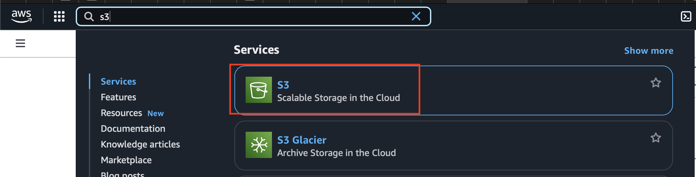
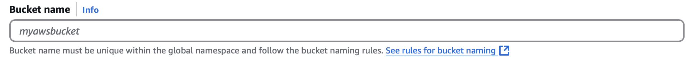
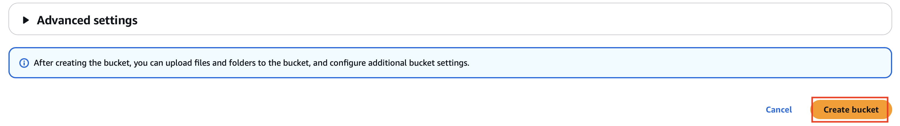
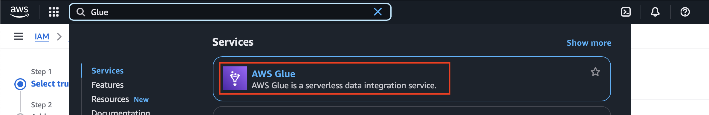
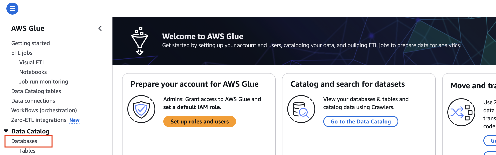
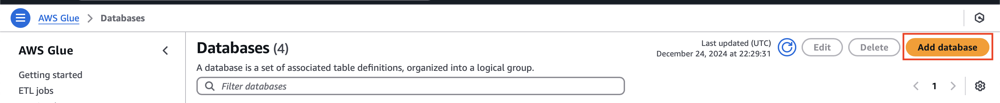
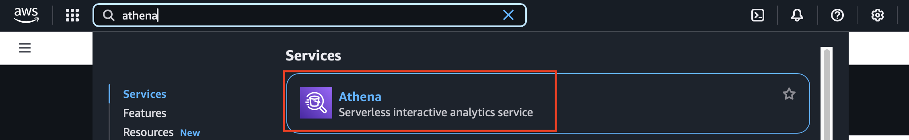
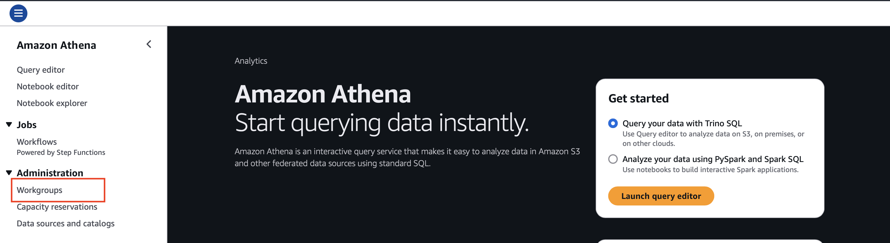
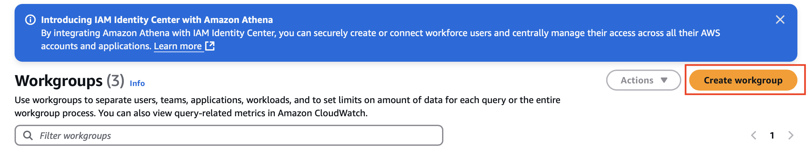
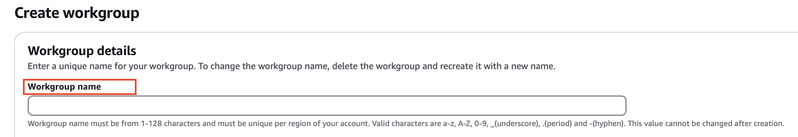

# WindWatts Data Package

 **windwatts_data** is a Python package which facilitates querying, filtering, downloading and analyzing climate data like WTK-LED Climate.

Please refer to the data section of the [documentation](https://nrel.github.io/windwatts-data/) to learn about different types of data sources before proceeding with setup.

## Cost Analysis
  - Use of this python package requires user to create their own AWS resources to access a public s3 bucket (**wtk-led**) which acts as a data source. Even though the bucket is public, any kind of data access using this package will result in cost applied to the user. The owner of the bucket (**NREL**) only pays for its storage cost.
  - **Expected cost**: 
    - Amazon Athena charges $5 per terabyte (TB) of data scanned, with a minimum charge of **$0.000047 for 10 MB** per query, meaning even small queries will incur a cost. This is because functions in the package uses **Athena** in the backend. Refer to documentation to learn about each function. This python package uses caching technique to reduce cost further. If any function is used with same parameters within the span of **7 days**, the user **will not be charged** for that request. Refer this link to learn more [AWS Athena Pricing](https://aws.amazon.com/athena/pricing/).
    - The user also pays for the storage cost of bucket created in the **step 2**, which stores query results and allows for caching discussed above.

# Setup

1. Log into your **AWS Management Console**.
    - Make sure your role or user account has required permissions to create resources mentioned in next steps.

2. **Create an S3 Bucket for Storing Results**. Here are the following steps to create an S3 bucket.

    - Go the search bar in the AWS Management Console and type 's3' and click on it.
    
    - Click on "Create Bucket".
    - Give a unique name in the "Bucket name" field (this bucket will be used to store athena query results).
     
    - Any change to other default settings is not required.
    - Add tags if needed. For example, billingId or other tags for cost management.
    - Scroll down and click "Create Bucket".
    

3. **Create Glue Database**. Here are the following steps to create.

    - Go the search bar in the AWS Management Console and type 'Glue' and click on it.
    
    - Click on Databases on the Glue sidemenu.
    
    - Click on Add Database button.
    
    - Fill in the desired database name on the field "Name" and click Create Database.

4. **Create Athena Workgroup**. Here are the following steps to create.
    - **Why a Workgroup?**
        - If you are a individual user you might not need to create a Workgroup. It is suggested to create one so it's easier to track metrics like cost and query performance etc.
        - But if your account is linked with an organization then, Athena workgroups help a company manage costs by tracking query usage and expenses separately for each team or project. By assigning specific workgroups for departments like Marketing or Finance, the company can monitor how much each is spending on data analysis. Workgroups also allow setting query limits and optimizing storage costs by directing query results to designated S3 buckets, ensuring efficient resource usage and preventing unnecessary spending.

    - Go the search bar in the AWS Management Console and type **Athena** and click on it.
    
    - Click on the **Workgroups** under **Administration** on the athena sidemenu.
    
    - Click on  **Create Workgroup**
    
    - Fill the  **Workgroup name** field with relevant name that identifies a certain a group.
    
    - For Analysis Engine and Authentication, leave it to the default settings.
    - In **Query Result Configuration**. Click on **Browse S3** and select the Bucket create in the **Step 2**.
    - In **Setting**, make sure **Publish query metrics to AWS CloudWatch** and **Override client-side settings** are enabled.
    - Add tags if needed. For example, billingId or other tags for cost management.
    - Click on "Create Workgroup".

5. **Create Athena Tables**

    - User has to create athena tables depending on what kind of data user wants to access.
    - Currently this package supports querying WTK-LED Climate data in 2 different formats - 1224 and Hourly.
    - **Each data source (e.g., WTK-LED 1224, WTK-LED Hourly) requires its own separate config file.**
    -  Inside each config file:
        - The fields athena_table_name and alt_athena_table_name must point to the correct tables created specifically for that data source, using the SQL queries provided above.
        - You cannot reuse the same config file across different data sources.
        - The Athena tables for WTK-LED 1224 data must be created using the WTK-LED 1224 CREATE TABLE queries.
        - The Athena tables for WTK-LED Full Hourly data must be created using the WTK-LED Full Hourly CREATE TABLE queries.
    
    ### WTK-LED 1224 Data
    - Select Query Editor on the Athena's side menu.
    - Select the Workgroup from the drop-down list at top-right created in step4.
    -  Select the database created in step3.

    **Table 1 (Queries with specific location or locations)**
    - Paste the below "Create" query into the query editor.
    ```sql
    CREATE EXTERNAL TABLE IF NOT EXISTS table_name (mohr STRING,
    precipitation_0m DOUBLE,
    pressure_0m DOUBLE,
    pressure_100m DOUBLE,
    pressure_200m DOUBLE,
    pressure_500m DOUBLE,
    temperature_1000m DOUBLE,
    temperature_100m DOUBLE,
    temperature_200m DOUBLE,
    temperature_2m DOUBLE,
    temperature_300m DOUBLE,
    temperature_30m DOUBLE,
    temperature_40m DOUBLE,
    temperature_500m DOUBLE,
    temperature_60m DOUBLE,
    temperature_80m DOUBLE,
    winddirection_1000m DOUBLE,
    winddirection_100m DOUBLE,
    winddirection_10m DOUBLE,
    winddirection_120m DOUBLE,
    winddirection_140m DOUBLE,
    winddirection_160m DOUBLE,
    winddirection_180m DOUBLE,
    winddirection_200m DOUBLE,
    winddirection_250m DOUBLE,
    winddirection_300m DOUBLE,
    winddirection_30m DOUBLE,
    winddirection_40m DOUBLE,
    winddirection_60m DOUBLE,
    winddirection_80m DOUBLE,
    winddirection_500m DOUBLE,
    windspeed_1000m DOUBLE,
    windspeed_100m DOUBLE,
    windspeed_10m DOUBLE,
    windspeed_120m DOUBLE,
    windspeed_140m DOUBLE,
    windspeed_160m DOUBLE,
    windspeed_180m DOUBLE,
    windspeed_200m DOUBLE,
    windspeed_250m DOUBLE,
    windspeed_300m DOUBLE,
    windspeed_40m DOUBLE,
    windspeed_30m DOUBLE,
    windspeed_500m DOUBLE,
    windspeed_60m DOUBLE,
    windspeed_80m DOUBLE
    )
    PARTITIONED BY (
    year STRING,
    varset STRING,
    index STRING
    )
    STORED AS PARQUET
    LOCATION 's3://wtk-led/1224-parquet/'
    TBLPROPERTIES (
    'parquet.compression'='SNAPPY',
    'projection.enabled' = 'true',
    'projection.year.type' = 'integer',
    'projection.year.range' = '2001,2020',
    'projection.varset.type' = 'enum',
    'projection.varset.values' = 'all',
    'projection.index.type' = 'injected',
    'storage.location.template' = 's3://wtk-led/1224-parquet/year=${year}/varset=${varset}/index=${index}/'
    );
    ```
    - Change the table name as desired and Run the query. This table name will be used as "**athena_table_name**" in the future steps.


    **Table 2( Queries without specific location or locations)**

    - Open another query window by select "+" button on the query editor.

    ```sql
    CREATE EXTERNAL TABLE IF NOT EXISTS table_name (mohr STRING,
    precipitation_0m DOUBLE,
    pressure_0m DOUBLE,
    pressure_100m DOUBLE,
    pressure_200m DOUBLE,
    pressure_500m DOUBLE,
    temperature_1000m DOUBLE,
    temperature_100m DOUBLE,
    temperature_200m DOUBLE,
    temperature_2m DOUBLE,
    temperature_300m DOUBLE,
    temperature_30m DOUBLE,
    temperature_40m DOUBLE,
    temperature_500m DOUBLE,
    temperature_60m DOUBLE,
    temperature_80m DOUBLE,
    winddirection_1000m DOUBLE,
    winddirection_100m DOUBLE,
    winddirection_10m DOUBLE,
    winddirection_120m DOUBLE,
    winddirection_140m DOUBLE,
    winddirection_160m DOUBLE,
    winddirection_180m DOUBLE,
    winddirection_200m DOUBLE,
    winddirection_250m DOUBLE,
    winddirection_300m DOUBLE,
    winddirection_30m DOUBLE,
    winddirection_40m DOUBLE,
    winddirection_60m DOUBLE,
    winddirection_80m DOUBLE,
    winddirection_500m DOUBLE,
    windspeed_1000m DOUBLE,
    windspeed_100m DOUBLE,
    windspeed_10m DOUBLE,
    windspeed_120m DOUBLE,
    windspeed_140m DOUBLE,
    windspeed_160m DOUBLE,
    windspeed_180m DOUBLE,
    windspeed_200m DOUBLE,
    windspeed_250m DOUBLE,
    windspeed_300m DOUBLE,
    windspeed_40m DOUBLE,
    windspeed_30m DOUBLE,
    windspeed_500m DOUBLE,
    windspeed_60m DOUBLE,
    windspeed_80m DOUBLE
    )
    PARTITIONED BY (
    year STRING,
    varset STRING
    )
    STORED AS PARQUET
    LOCATION 's3://wtk-led/1224-parquet/'
    TBLPROPERTIES (
    'parquet.compression'='SNAPPY',
    'projection.enabled' = 'true',
    'projection.year.type' = 'integer',
    'projection.year.range' = '2001,2020',
    'projection.varset.type' = 'enum',
    'projection.varset.values' = 'all',
    'storage.location.template' = 's3://wtk-led/1224-parquet/year=${year}/varset=${varset}/'
    );
    ```
    - Change the table name as desired and Run the query. This table name will be used as "**alt_athena_table_name**" in the future steps.

    ### WTK-LED Hourly Data
    - Select Query Editor on the Athena's side menu.
    - Select the Workgroup from the drop-down list at top-right created in step4.
    -  Select the database created in step3.

    **Table 1 (Queries with specific location or locations)**
    - Paste the below "Create" query into the query editor.
    ```sql
    CREATE EXTERNAL TABLE IF NOT EXISTS table_name (time_index STRING,
    precipitation_0m DOUBLE,
    pressure_0m DOUBLE,
    pressure_100m DOUBLE,
    pressure_200m DOUBLE,
    pressure_500m DOUBLE,
    temperature_1000m DOUBLE,
    temperature_100m DOUBLE,
    temperature_200m DOUBLE,
    temperature_2m DOUBLE,
    temperature_300m DOUBLE,
    temperature_30m DOUBLE,
    temperature_40m DOUBLE,
    temperature_500m DOUBLE,
    temperature_60m DOUBLE,
    temperature_80m DOUBLE,
    winddirection_1000m DOUBLE,
    winddirection_100m DOUBLE,
    winddirection_10m DOUBLE,
    winddirection_120m DOUBLE,
    winddirection_140m DOUBLE,
    winddirection_160m DOUBLE,
    winddirection_180m DOUBLE,
    winddirection_200m DOUBLE,
    winddirection_250m DOUBLE,
    winddirection_300m DOUBLE,
    winddirection_30m DOUBLE,
    winddirection_40m DOUBLE,
    winddirection_60m DOUBLE,
    winddirection_80m DOUBLE,
    winddirection_500m DOUBLE,
    windspeed_1000m DOUBLE,
    windspeed_100m DOUBLE,
    windspeed_10m DOUBLE,
    windspeed_120m DOUBLE,
    windspeed_140m DOUBLE,
    windspeed_160m DOUBLE,
    windspeed_180m DOUBLE,
    windspeed_200m DOUBLE,
    windspeed_250m DOUBLE,
    windspeed_300m DOUBLE,
    windspeed_40m DOUBLE,
    windspeed_30m DOUBLE,
    windspeed_500m DOUBLE,
    windspeed_60m DOUBLE,
    windspeed_80m DOUBLE
    )
    PARTITIONED BY (
    year STRING,
    varset STRING,
    index STRING
    )
    STORED AS PARQUET
    LOCATION 's3://wtk-led/ts-parquet/'
    TBLPROPERTIES (
    'parquet.compression'='SNAPPY',
    'projection.enabled' = 'true',
    'projection.year.type' = 'integer',
    'projection.year.range' = '2001,2020',
    'projection.varset.type' = 'enum',
    'projection.varset.values' = 'all',
    'projection.index.type' = 'injected',
    'storage.location.template' = 's3://wtk-led/ts-parquet/year=${year}/varset=${varset}/index=${index}/'
    );
    ```
    - Change the table name as desired and Run the query. This table name will be used as "**athena_table_name**" in the future steps.


    **Table 2( Queries without specific location or locations)**

    - Open another query window by select "+" button on the query editor.

    ```sql
    CREATE EXTERNAL TABLE IF NOT EXISTS table_name (time_index STRING,
    precipitation_0m DOUBLE,
    pressure_0m DOUBLE,
    pressure_100m DOUBLE,
    pressure_200m DOUBLE,
    pressure_500m DOUBLE,
    temperature_1000m DOUBLE,
    temperature_100m DOUBLE,
    temperature_200m DOUBLE,
    temperature_2m DOUBLE,
    temperature_300m DOUBLE,
    temperature_30m DOUBLE,
    temperature_40m DOUBLE,
    temperature_500m DOUBLE,
    temperature_60m DOUBLE,
    temperature_80m DOUBLE,
    winddirection_1000m DOUBLE,
    winddirection_100m DOUBLE,
    winddirection_10m DOUBLE,
    winddirection_120m DOUBLE,
    winddirection_140m DOUBLE,
    winddirection_160m DOUBLE,
    winddirection_180m DOUBLE,
    winddirection_200m DOUBLE,
    winddirection_250m DOUBLE,
    winddirection_300m DOUBLE,
    winddirection_30m DOUBLE,
    winddirection_40m DOUBLE,
    winddirection_60m DOUBLE,
    winddirection_80m DOUBLE,
    winddirection_500m DOUBLE,
    windspeed_1000m DOUBLE,
    windspeed_100m DOUBLE,
    windspeed_10m DOUBLE,
    windspeed_120m DOUBLE,
    windspeed_140m DOUBLE,
    windspeed_160m DOUBLE,
    windspeed_180m DOUBLE,
    windspeed_200m DOUBLE,
    windspeed_250m DOUBLE,
    windspeed_300m DOUBLE,
    windspeed_40m DOUBLE,
    windspeed_30m DOUBLE,
    windspeed_500m DOUBLE,
    windspeed_60m DOUBLE,
    windspeed_80m DOUBLE
    )
    PARTITIONED BY (
    year STRING,
    varset STRING
    )
    STORED AS PARQUET
    LOCATION 's3://wtk-led/ts-parquet/'
    TBLPROPERTIES (
    'parquet.compression'='SNAPPY',
    'projection.enabled' = 'true',
    'projection.year.type' = 'integer',
    'projection.year.range' = '2001,2020',
    'projection.varset.type' = 'enum',
    'projection.varset.values' = 'all',
    'storage.location.template' = 's3://wtk-led/ts-parquet/year=${year}/varset=${varset}/'
    );
    ```
    - Change the table name as desired and Run the query. This table name will be used as "**alt_athena_table_name**" in the future steps.

    **Run Checks**

    - Run the below 2 sql queries, 1 for each of the 2 tables created above with respect to the data you want to work with.
    
        - **For table 1**
        ```sql
        select * from first_table_name where year='2001' and index='000000' limit 10;
        ```
        Do not worry about what index means here. Usually latitide and longitude is mapped to index during runtime to retrieve corresponding file in data source bucket.
        - **For table 2**
        ```sql
        select windspeed_100m from second_table_name where year='2001' limit 10;
        ```
    - Please include limit in the query to avoid unneccessary charges just for the check.

    **Congrats, that's all for AWS Setup**

6. **Install Package**
    1. **Repository Cloning**:
        ```
        git clone https://github.com/NREL/windwatts-data.git
        cd windwatts-data
        pip install .
        ```

    2. **Download the package file** from the versions folder in the repo. Click on the package and select "raw" to download.
    
        **For MacOS**
        - To install the package, go to your project directory and create a python environment using "python/python3" or "conda".
            ```
            python3 -m venv env_name
            ```
        - Activate the python environment.
            ```
            source ./env_name/bin/activate
            ```
        - Install the package using pip command.
            ```
            pip install /path/to/downloaded/package/file
            ```
        **For Windows**
        -  To install the package, go to your project directory and create a python environment using "python/python3" or "conda".
            ```
            python3 -m venv env_name
            ```
        - Activate the python environment.
            ```
            ./env_name/Scripts/activate
            ```
        - Install the package using pip command.
            ```
            pip install /path/to/downloaded/package/file
            ```
7. **Setting up Config file**
    - Within your project directory create a json file called **config_file.json**.
    - We have to include the names of the resources we created in previous steps.

        ```json
            {
            "region_name": "us-west-2",
            "bucket_name": "wtk-led",
            "database": "name_of_database_created_in_step3",
            "output_location": "s3://name_of_bucket_created_in_step2/",
            "output_bucket": "name_of_bucket_created_in_step2",
            "athena_table_name": "name_of_table_1_created_in_step5 (with respect to the data source)",
            "alt_athena_table_name":"name_of_table_2_created_in_step5 (with respect to the data source)",
            "athena_workgroup":"name_of_workgroup_created_in_step4"
            }
        ```
    - The values for region_name and bucket_name will be constant.
    - Example config_file.json
        ```json
            {
            "region_name": "us-west-2",
            "bucket_name": "wtk-led",
            "database": "wtk_database",
            "output_location": "s3://wtk-athena-results/",
            "output_bucket": "wtk-athena-results",
            "athena_table_name": "table1",
            "alt_athena_table_name":"table2",
            "athena_workgroup":"nrel_dtsw_rockstars"
            }
        ```
8. **Using Package**

    - Jupyter notebooks are available in the notebooks directory of this repository to demonstrate how to use various classes and functions within the package.
    - Ensure your **AWS credentials** are active in the environment where the package will be used.
    - **For Notebooks**:
        - create a .env file in the root directory and define AWS credentials in it.
            ```
            # .env file
            AWS_ACCESS_KEY_ID="your_access_key_here"
            AWS_SECRET_ACCESS_KEY="your_secret_access_key_here"
            AWS_SESSION_TOKEN="your_session_token_here"
            ```
        - In the notebook:
            ```
            pip install python-dotenv
            ```
            ```
            from dotenv import load_dotenv

            load_dotenv()  # loads environment variables
            ```

        

## Credit

This python package is currently being developed and maintained by Sameer Shaik (sameer.shaik@nrel.gov), under the guidance of Caleb Phillips (caleb.phillips@nrel.gov) and Duplyakin Dmitry(dmitry.duplyakin@nrel.gov).

## License

Copyright (c) 2025, National Renewable Energy Laboratory (NREL)
All rights reserved. See LICENSE for additional information.


